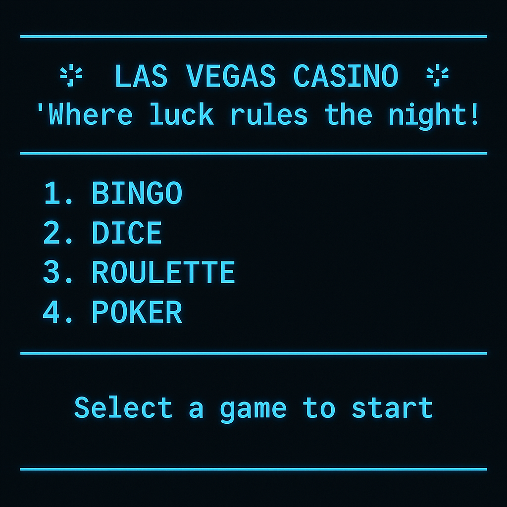

[](https://classroom.github.com/a/mi1WNrHU)
# C++ Project - Casino “LAS VEGAS”.🎰

## Description of the Project💸

Welcome to the legendary Las Vegas Casino, the ultimate destination for unforgettable nights! This elite virtual casino offers four main games that will test your luck and strategy: Poker, Roulette, Bingo, and Dice — all designed for an immersive multiplayer experience.

The night begins with a main bet, a fixed amount of virtual currency that players can split into smaller wagers to participate in multiple games. Each game offers a unique chance to rise through the ranks, take bold risks, and dominate your opponents.

As the night comes to an end, the system will reveal the Grand Champion, the player who not only secured the highest number of victories across all games but also racked up the highest overall score. At Las Vegas Casino, fun is guaranteed.🔥

## Implementation of Course Concepts🛠️

1. **Structures**📌

-Player struct stores each player’s name and balance.

-Card struct used in Poker to store number, suit, and color.

-Shared player data via global array Player data[2].

2. **Arrays**📌

-Used to store players, cards, bingo boards, dice visuals, game results, and menu options.

-Examples: dice[6][5], reds[], hands of cards, bingo matrices.

3. **Functions**📌

Modular code using functions like:

rollDice(), showDiceHorizontal() – Dice

EvaluateHand(), TradeCards() – Poker

validateBet(), playRoulette() – Roulette

add(), Save(), Read() – Player profiles

mainMenu(), showLogo() – Menu

4. **if/ else**📌

-Controls game outcomes (win, lose, tie)

-Validates minimum bets and available balance.

-Checks for correct matches (e.g., cards, bingo, roulette).

-Handles invalid or incorrect inputs.


5.  **for**📌

-Iterates through players, rounds, cards, and bingo boards.

-Used to print visuals like dice and cards.

-Loops through arrays for scoring and data handling.

6. **while/ do while**📌

-Keeps menus or games running until exit conditions are met.

-Repeats prompts until valid input is received.

-Maintains game rounds (e.g., up to 6 rounds or until someone wins 3).

-Used to ensure no repeated cards when dealing poker hands.

-Runs at least once before checking for repetitions or conditions.

7. **switch**📌

-Handles main menu navigation.

-Controls card visuals in Poker.

-Applies logic based on user selections.


8. **File Handling**📌

-Saves and reads player profiles and game results using fstream.

-Files like Dice_scores.txt, Roulette_scores.txt used for data storage.


9. **User Interface and Console**📌

-system("cls") and system("pause") for clean screen control.

-Centered text, ASCII graphics for cards and dice.

-Visually organized menu with options to choose each game.

10. **Libraries Used**📌

iostream: Handles input and output (cin, cout).

fstream: Reads from and writes to .txt files (ifstream, ofstream).

string: Manages text input like player names, colors, and bets.

cstdlib: Enables system functions (system("cls"), rand(), exit()).

ctime: Seeds random number generation (srand(time(NULL))).

iomanip: Formats output alignment (setw(), setprecision()).

cctype: Converts character cases (tolower(), toupper()).

algorithm: Sorts or compares arrays (sort()).

## Team💡

- **Team Name:** Los alucines.

### Team members

1. **Name:** Alonzo Gómez, Astrid Adamaris
   **ID:** 00091525

2. **Name:** Barrera Gómez, Heraldo Riquelmy 
   **ID:** 00226325

3. **Name:** Cornejo Miranda, Steven Eduardo   
   **ID:** 00177125

4. **Name:** Escobar Arteaga, Rosario Guadalupe 
   **ID:** 00235325 

## Execution Instructions📘

1. Clone this repository on your local machine:
   ```bash
   git clone https://github.com/FDP-01-2025/project-los-alucines.git

2. Browse to the cloned repository folder and type this into bash:
   ```bash
   code .

3. Once inside Visual Studio Code open a new terminal (Ctrl + shift + ñ) and type the following to compile the game:
   ```bash
   g++ main.cpp -o i 

## Mockup of the Game
<h2 align="center">🎲 Mockup of the Game</h2>

<p align="center">
  
</p>

